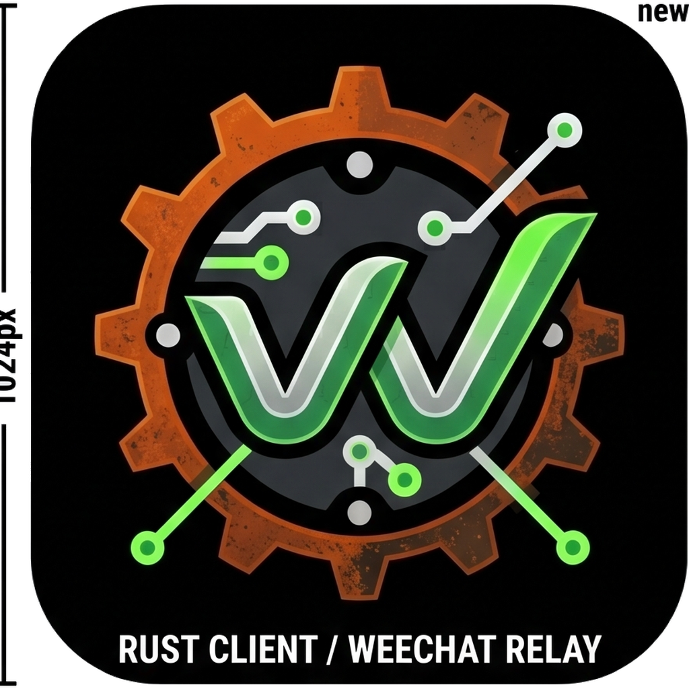
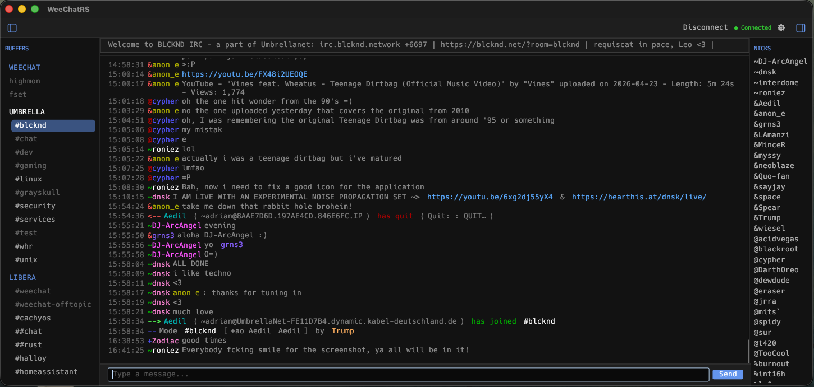
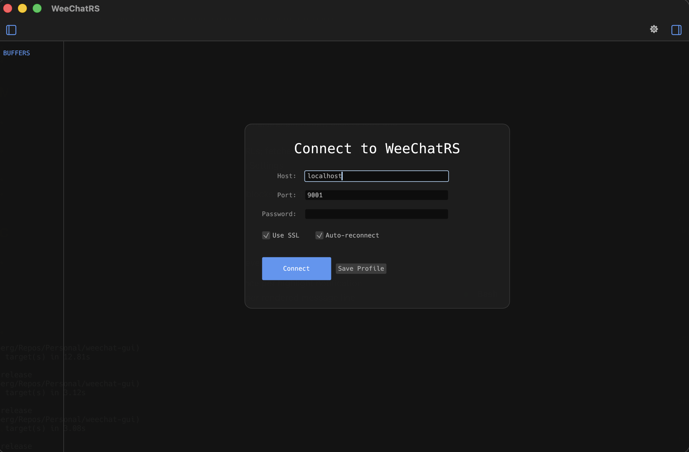
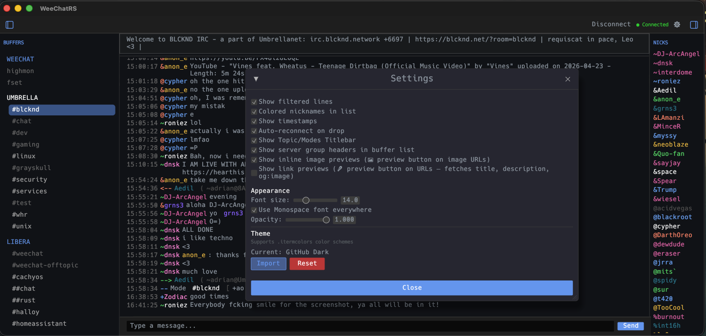
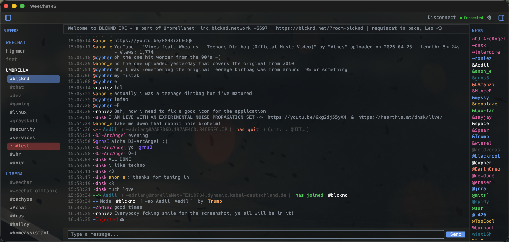
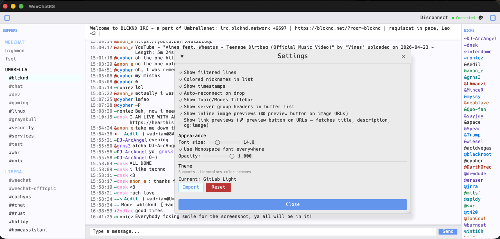

<div align="center">
  
  <h1>WeeChatRS</h1>
  <p>A modern, high-performance GUI client for <a href="https://weechat.org/">WeeChat</a> Relay,<br>
  built in Rust using <code>egui</code> and <code>tokio</code>.<br>
  Real-time chat with a polished native UI, full ANSI color support, and zero runtime dependencies.</p>
</div>

## Features

- **Dual backend** — connects to a WeeChat Relay (WebSocket) *or* directly to any IRC server / soju bouncer (TCP/TLS)
- **Full WeeChat Relay API v2** over WebSocket with SSL/TLS
- **IRCv3** — extensive capability negotiation; see [IRCv3 support](#ircv3-support) below
- **soju bouncer support** — network list, per-network buffers, read-marker sync; see [Soju support](#soju-support) below
- **Advanced ANSI engine** — 16-color, 256-color, and TrueColor (RGB) sequences rendered natively
- **Read synchronization** — bidirectional sync of read markers; unread divider line shows where you left off
- **Server group headers** — buffer list automatically groups channels by network with labeled dividers (toggleable)
- **Tab completion** — nicknames and emoji (`:fire` + Tab → 🔥), cycling through all matches
- **Command history** — Arrow Up/Down in the input bar
- **Inline search** — `Ctrl+F` filters current buffer scrollback
- **Context menus** — right-click nicks for `/query` and `/whois`; right-click buffers to leave or close
- **Buffer reordering** — drag and drop buffers and server groups in the buffer list; order persists across restarts
- **Auto-reconnect** — exponential backoff on dropped connections, with dead-connection detection (IRC PING/PONG keepalive; WebSocket idle timeout)
- **Theming** — import any `.itermcolors` file; background, foreground, and all 16 ANSI colors applied live
- **Native notifications** — system alerts for highlights and private messages
- **Opacity control** — real-time transparency adjustment

## Keyboard Shortcuts

| Shortcut | Action |
| :--- | :--- |
| `Meta + ↑ / ↓` | Cycle buffers |
| `Meta + B` | Toggle buffer list |
| `Meta + N` | Toggle nick list |
| `Meta + T` | Toggle toolbar |
| `Ctrl + F` | Toggle message search |
| `Tab` | Complete nick or emoji (cycles matches) |
| `Arrow ↑ / ↓` | Cycle command history (input bar) |
| `Enter` | Send message |
| Right-click nick | Query / Whois |
| Right-click buffer | Leave / Close |

## Platform Support

> **Note:** WeeChatRS has only been tested on **macOS**. It may build and run on Linux and Windows, but these platforms are untested. Contributions and bug reports for other platforms are welcome.

## WeeChat Requirements

WeeChatRS connects via the **WeeChat Relay API v2** (WebSocket). You need WeeChat 4.0.0 or later with the `relay` plugin enabled and configured.

### Enabling the WeeChat Relay

In WeeChat, run the following commands:

```
/relay add api 9000
/set relay.network.password "your-password"
```

Replace `9000` with your preferred port. For SSL, load a certificate and enable it on the relay port:

```
/set relay.network.ssl_certfile /path/to/cert.pem
/relay add tls.api 9001
```

**Verify the relay is listening:**
```
/relay listfull
```

You should see an `api` relay entry with status `listening`. Once it is running, launch WeeChatRS and connect using the host, port, and password you configured above.

> The relay listens for WebSocket connections at `ws(s)://host:port/api`. Make sure any firewall or router allows TCP on the relay port if connecting remotely.

## IRCv3 support

All capabilities are negotiated via `CAP LS 302` on connect and requested only when the server advertises them. `cap-notify` allows new caps to be requested mid-session.

| Capability | Behaviour |
| :--- | :--- |
| `sasl` | SASL PLAIN authentication; only requested when a password is configured |
| `message-tags` | Enables server-time, msgid, and other tag-based features |
| `server-time` | Accurate message timestamps from the `@time=` tag |
| `multi-prefix` | All mode prefixes shown per nick (e.g. `@+`) in NAMES and WHO |
| `away-notify` | Server pushes `AWAY` when a nick's away status changes; nicklist dims away nicks |
| `account-notify` | Server pushes `ACCOUNT` on services login/logout; shown as a channel notice |
| `extended-join` | JOIN includes the account name; displayed in join messages |
| `batch` | Used to deliver `chathistory` replies as a single atomic batch |
| `chathistory` | `CHATHISTORY LATEST` fetched on join; `CHATHISTORY BEFORE` used for scroll-back |
| `echo-message` | Server echoes sent messages back; local self-echo is suppressed to avoid duplicates |
| `invite-notify` | Receive `INVITE` events for other users in shared channels |
| `chghost` | Host changes for nicks in shared channels shown as a channel notice |
| `userhost-in-names` | `nick!user@host` format in NAMES is parsed and stripped correctly |
| `cap-notify` | Newly advertised caps are requested dynamically mid-session |
| `labeled-response` | Negotiated for future use; responses flow through normal handlers immediately |
| `msgid` | Deduplicates messages by ID to prevent bouncer replay duplicates (ring-buffer capped at 2000) |
| `MONITOR` | `MONITOR + nick` sent when a DM buffer is opened; online/offline status shown in the DM buffer |

CTCP auto-responses: `PING` (echo token back) and `VERSION` (replies with app name and version).

## Soju support

WeeChatRS can connect directly to a [soju](https://soju.im/) bouncer as an IRC backend.

| Feature | Behaviour |
| :--- | :--- |
| `soju.im/bouncer-networks` | Detected on `CAP ACK`; switches to bouncer mode — each upstream network gets its own buffer group |
| Bouncer network buffers | `BOUNCER NETWORK LIST` parsed on connect; each network opens as a server buffer showing its connected/disconnected state |
| `soju.im/read-marker` | `MARKREAD {buffer} timestamp=…` sent on buffer selection to sync read position across all soju clients |
| Direct IRC via soju | The same IRC backend works for plain servers too; soju-specific caps are only used when advertised |

## Building from Source

See [BUILDING.md](BUILDING.md) for full instructions covering macOS, Linux, Windows (native and WSL 2), and cross-compilation.

## Transparency on Windows

Requires **Transparency effects** to be enabled: Settings → Personalization → Colors → Transparency effects: On. Without it the window renders with a solid background.

## Architecture

```
src/
  main.rs                    — tokio runtime, eframe window setup, app icon loading
  relay/
    backend.rs               — BackendClient trait + BackendEvent enum (protocol-agnostic)
    models.rs                — Buffer, Line, Nick, BufferActivity, WeeChatResponse
    weechat/
      mod.rs                 — WeeChat WebSocket client, auth, reconnect, idle keepalive
      event_handler.rs       — WeeChatResponse → BackendEvent, hotlist, buffer sync,
                               read-state tracking
    irc/
      mod.rs                 — IrcClient: BackendClient impl, command dispatch
      connection.rs          — TCP/TLS connection loop, IRCv3 CAP negotiation, SASL,
                               PING/PONG keepalive, message translation → BackendEvent
      parser.rs              — IRCv3 message parser (tags, prefix, command, params)
  ui/
    mod.rs                   — ui module re-exports
    app.rs                   — WeeChatApp struct, AppSettings, main render loop,
                               buffer list drag-and-drop reorder, layout panels
    event_handler.rs         — BackendEvent dispatch, multi-connection buffer grouping
    input.rs                 — nick and emoji tab completion, command history,
                               buffer keyboard navigation
    ansi.rs                  — ANSI SGR parser (8-color, 256-color, TrueColor,
                               bold, italic, underline, URL detection)
    theme.rs                 — AppTheme, .itermcolors plist parser, accent color derivation
    settings.rs              — Settings and Connections window UI
    emoji.rs                 — emoji shortcode table (~150 entries)
```

## Screenshots


*Main chat window — buffer list on the left, ANSI-colored IRC messages in the center, nick list on the right*


*Connection dialog — host, port, password, SSL toggle, and auto-reconnect option*


*Settings panel — display options, font size, opacity slider, and theme import*


*Highlight notification — nick mention shown with accent color in the message view*


*Light color theme applied — full UI with settings window open*

## Contributing

See [CONTRIBUTING.md](CONTRIBUTING.md) for guidelines. See `todo.md` for planned features and known issues.

## Development Notes

[Claude Code](https://claude.ai/code) was used throughout development for debugging, refactoring, and release management. All code has been reviewed and tested by the project author.

## License

MIT License — Copyright (c) 2026

---

[Contact](CONTACT.md)
